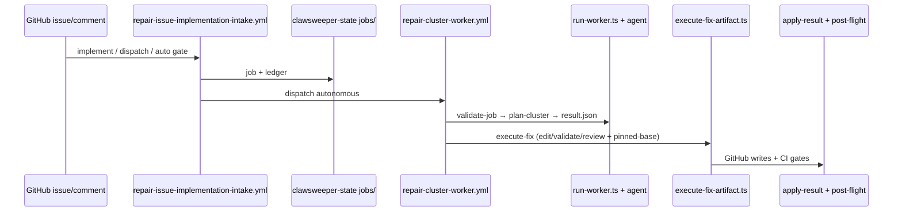

# Loop / ClawSweeper → Devin Port Map

**Audit date:** 2026-07-11 (revalidated)  
**Canonical repository:** [`kartikkabadi/loop`](https://github.com/kartikkabadi/loop) (private)  
**Canonical local path:** `/Users/user/Developer/loop`  
**Scope:** AUDIT / documentation only — no production behavior changed.

---

## 0. Repository identity (authoritative)

| Check | Required | Observed |
|---|---|---|
| Product repo | `kartikkabadi/loop` | `https://github.com/kartikkabadi/loop` |
| Local path | `/Users/user/Developer/loop` | Present; full clone |
| `origin` | `kartikkabadi/loop` | `https://github.com/kartikkabadi/loop.git` |
| `upstream` | `openclaw/clawsweeper` | `https://github.com/openclaw/clawsweeper.git` |
| Shallow? | No | `git rev-parse --is-shallow-repository` → `false` |
| Tags preserved | Yes | 3 tags (`v0.1.0`, `v0.2.0`, `v0.3.0`) |
| Default branch | `main` | Tracks `origin/main` |
| Push to upstream | Never | Only `origin` receives pushes |

**Aligned SHAs (bootstrap):**

```text
main          = a0a3b241af5c11b040d601b6fd117d2d451f9fbe
upstream/main = a0a3b241af5c11b040d601b6fd117d2d451f9fbe
origin/main   = a0a3b241af5c11b040d601b6fd117d2d451f9fbe
```

**Prior temporary audit (non-authoritative):** `/private/tmp/loop-ref/clawsweeper` inspected shallow tip `ef7a067f7170b422d40d03094cc69b2803c1ab2f` with `origin` incorrectly pointing at `openclaw/clawsweeper` and no `upstream` remote. That checkout must not be treated as the Loop repository.

---

## 1. Executive conclusion

Loop retains ClawSweeper’s autonomous GitHub lifecycle and replaces the **Codex / OpenAI agent runtime** with **Devin**, using **Devin ACP** as the durable programmatic session control plane. Non-interactive `devin -p` is **not** the permanent architecture; it is allowed only as diagnostic fallback, bootstrap smoke, or an explicitly temporary spike.

ClawSweeper’s intake, jobs, scheduling, validators, GitHub mutations, ledgers, and automerge policy are largely **model-neutral** and must be preserved. The intelligent coding/review agent is **structurally coupled** to Codex CLI (`codex exec`, `codex app-server`, Responses proxy, `--output-schema`, JSONL transcripts, steerable thread/turn RPCs). Spam scanning additionally calls the OpenAI Responses API directly (`src/repair/spam-scanner.ts`).

**Port strategy:** extract an `AgentRuntime` seam → host-owned structured-result validation → empirical Devin ACP proof on ASCII Box → production `DevinRuntime` (ACP-first) → Crabbox/ASCII execution → role cutover → workflow/credential cutover → remove Codex/OpenAI only after soak. Do **not** invent a greenfield Loop control plane.

---

## 2. Upstream delta since the temporary audit

| Item | Value |
|---|---|
| Original temporary-audit SHA | `ef7a067f7170b422d40d03094cc69b2803c1ab2f` |
| Current upstream/main SHA | `a0a3b241af5c11b040d601b6fd117d2d451f9fbe` |
| Commits in range | 2 |

```text
a0a3b241af fix: pin repair review bases and renew post-flight credentials (#494)
6826d1dac2 chore(repo): extend pnpm release-age window
```

**Changed files (`git diff --name-status ef7a067..upstream/main`):**

| Status | Path | Port impact |
|---|---|---|
| M | `.github/workflows/repair-cluster-worker.yml` | Post-flight token renew step; still installs Codex via `setup-codex` |
| M | `pnpm-workspace.yaml` | Release-age window only — no agent coupling |
| M | `src/repair/execute-fix-artifact.ts` | **Deepens Codex coupling**: pinned `targetBaseSha`, `runCodexReview` after final base sync, `codexReview.final_base_sync` |
| A | `src/repair/execution-finalization.ts` | Model-neutral helpers (`reviewAfterFinalBaseSync`, `finalizeExecutionReport`) — **preserve** |
| A | `src/repair/execution-finalization.test.ts` | Neutral unit tests |
| M | `src/repair/fix-prompt-builder.ts` | Adds `Pinned target base SHA` line to fix prompts |
| M | `src/repair/target-validation.ts` | Pinned-base validation support — mostly neutral, used by Codex review loops |
| M | `test/repair/execute-fix-artifact-source.test.ts` | Tests for pinned-base / Codex review wiring |
| A | `test/repair/execute-fix-publication.test.ts` | Publication finalization tests |

**Correction vs temporary audit:** repair execute is **more** Codex-coupled than at `ef7a067` because independent `/review` must re-run against a pinned/synchronized base before push (`execute-fix-artifact.ts` ~L2290–2314, `runCodexReview` ~L2943+). Any Devin port must preserve this **pinned-base + post-sync review** gate, not only the older edit/validate loop.

---

## 3. Current architecture

```text
GitHub events / schedule / maintainer comments
        │
        ▼
GitHub Actions (.github/workflows/*)
  sweep.yml | repair-*-*.yml | assist.yml | commit-review.yml | spam-scanner.yml
        │
        ├── setup-codex (@openai/codex + responses-api-proxy)
        ├── GitHub App token mint (CLAWSWEEPER_APP_PRIVATE_KEY)
        └── Node CLIs (pnpm → dist/*.js)
                │
                ├── Review: clawsweeper.ts → runCodex → runCodexProcess
                ├── Plan: repair/run-worker.ts → codex exec + schema/repair/codex-result.schema.json
                ├── Execute: execute-fix-artifact.ts → Codex edit/validate/review (+ pinned-base re-review)
                ├── Steerable (opt-in): codex-app-server-worker.ts + CrabFleet action-session
                └── Deterministic: apply-result / post-flight / apply-decisions / execution-finalization
                        │
                        ▼
              openclaw/clawsweeper-state (records/, jobs/, results/)
```

**Security invariant:** model subprocesses must not receive GitHub write credentials (`src/codex-env.ts` `codexEnv()` strips `GH_TOKEN`, `GITHUB_TOKEN`, App keys, CrabFleet tokens; strips OpenAI keys when proxy auth is used).

**Execution plane today:** GitHub Actions on `ubuntu-latest` / `blacksmith-*-ubuntu-2404`. Crabbox is hydrate/operator proof (`.crabbox.yaml`, `crabbox-hydrate.yml`), not the production repair host. Sibling Crabbox already ships `provider: ascii-box`.

---

## 4. Complete Codex-coupling inventory (recomputed)

### 4.1 Deterministic inventory command

Run from repository root on a clean tree (no `node_modules`/`dist` required for the search itself):

```bash
find . \
  \( -path './.git' -o -path './node_modules' -o -path './dist' -o -path './.artifacts' \) -prune \
  -o -type f \( \
    -name '*.ts' -o -name '*.js' -o -name '*.mjs' -o -name '*.yml' -o -name '*.yaml' \
    -o -name '*.md' -o -name '*.json' -o -name '*.sh' -o -name '*.toml' \
  \) -print \
| sed 's|^\./||' \
| grep -Ev '^(node_modules/|dist/|\.artifacts/|pnpm-lock\.yaml$|CHANGELOG\.md$|DEVIN_PORT_MAP\.md$|TASKS\.md$)' \
| while IFS= read -r f; do
    rg -qi 'codex|openai|OPENAI_API_KEY|CODEX_HOME|app-server|output-schema|output-last-message' -- "$f" \
      && printf '%s\n' "$f"
  done \
| sort -u
```

**Inclusion:** source, tests, workflows/actions, scripts, prompts, schemas, docs, dashboard, instructions, agents skills, package/tsconfig, `.crabbox.yaml`.  
**Exclusion:** `.git/`, `node_modules/`, `dist/`, `.artifacts/`, `pnpm-lock.yaml`, `CHANGELOG.md`, and these audit docs themselves.

### 4.2 Result on `a0a3b241af`

**Count: 141 unique files** (independently recomputed on the canonical full clone).

| Area | Count |
|---|---:|
| `test/` | 54 |
| `src/` | 39 |
| `docs/` | 16 |
| `.github/` | 13 |
| `scripts/` | 4 |
| `prompts/` | 4 |
| `schema/` | 2 |
| `.agents/` | 2 |
| Other (`package.json`, `AGENTS.md`, `README.md`, `dashboard/`, `instructions/`, `tsconfig.repair.json`, `.crabbox.yaml`) | 7 |

New upstream files `execution-finalization.ts` / related tests do **not** match the inventory regex (model-neutral) and correctly do not inflate the count. Coupling depth increased inside already-counted `execute-fix-artifact.ts`.

### 4.3 Structural core (must replace or adapt behind a seam)

| File | Key symbols | Coupling |
|---|---|---|
| `src/codex-process.ts` | `runCodexProcess`, `codexAppServerProcessOptionsFromEnv` | Worker vs app-server; `CLAWSWEEPER_STEERABLE_CODEX` |
| `src/codex-process-worker.ts` | `spawnCodex`, `terminateCodexProcessTree` | Stdio relay to `codex` |
| `src/codex-app-server-worker.ts` | `thread/start`, `thread/resume`, `turn/start`, `turn/steer`, `turn/interrupt` | Codex app-server JSON-RPC; `--output-schema` parsing |
| `src/codex-spawn.ts` | `codexProcessCommand`, `spawnCodex` | `CODEX_BIN` |
| `src/codex-env.ts` | `codexEnv`, `codexModelArgs` | Auth stripping / model alias |
| `src/codex-output-capture.ts` | `openCodexOutputCapture` | Tail capture |
| `src/codex-transient.ts` | `codexJsonlFailureDetail`, retry taxonomy | JSONL / rate-limit parsing |
| `src/clawsweeper.ts` | `runCodex`, `runCodexAssist` | Review `codex exec --output-schema --output-last-message --json` |
| `src/commit-sweeper.ts` / `src/pr-close-coverage-proof.ts` | `runCodexProcess` | Commit / proof lanes |
| `src/repair/run-worker.ts` | `runCodex`, `repairResultIfNeeded` | Plan + structured-result repair |
| `src/repair/execute-fix-artifact.ts` | `runCodexReview`, `validateAndReviewLoop`, `reviewAfterFinalBaseSync` | Edit/validate/review + **pinned-base re-review** |
| `src/repair/process-env.ts` | `codexSubprocessEnv` | Repair env / tiers |
| `src/repair/collect-codex-debug.ts` | `collectCodexDebug` | `CODEX_HOME` harvest |
| `src/repair/spam-scanner.ts` | `scanWithModel` → `api.openai.com/v1/responses` | Direct OpenAI API |
| `.github/actions/setup-codex/action.yml` | Install `@openai/codex@0.139.0` + proxy | CI auth |
| `scripts/check-local-codex.mjs` | Local smoke | Codex login/exec |
| `schema/clawsweeper-decision.schema.json` | Review schema | `--output-schema` |
| `schema/repair/codex-result.schema.json` | Repair schema | Includes `merge_preflight.codex_review` |

### 4.4 Workflows installing/invoking Codex or OpenAI

| Workflow | Codex install | Model invoke | Secrets |
|---|---|---|---|
| `sweep.yml` | `setup-codex` | `pnpm review` | `OPENAI_API_KEY`, `CLAWSWEEPER_MODEL` |
| `assist.yml` | yes | assist | same |
| `commit-review.yml` | yes | commit-sweeper | same |
| `maintainer-activity-report.yml` | yes | report gen | same |
| `repair-cluster-worker.yml` | yes | plan + execute + debug | same + CrabFleet token; **post-flight token renew** (#494) |
| `repair-commit-finding-intake.yml` | yes | execute | same |
| `spam-scanner.yml` | no | Responses API | `OPENAI_API_KEY` |

### 4.5 Env vars (Codex / OpenAI)

**Native:** `OPENAI_API_KEY`, `CODEX_BIN`, `CODEX_HOME`, `CODEX_API_KEY`, `CODEX_ACCESS_TOKEN`, `PROXY_API_KEY`.  
**ClawSweeper:** `CLAWSWEEPER_INTERNAL_MODEL` / `CLAWSWEEPER_MODEL`, `CLAWSWEEPER_CODEX_*` (timeouts, reasoning, service tier, sandboxes, heartbeats, retries), `CLAWSWEEPER_STEERABLE_CODEX`, `CLAWSWEEPER_CODEX_THREAD_STATE`, `CLAWSWEEPER_RESULT_REPAIR_*`, CrabFleet PTY/token URLs.

---

## 5. Model-neutral systems to preserve

Classification: **(1)** completely model-neutral · **(2)** mostly neutral + Codex terminology · **(3)** structurally Codex-coupled · **(4)** obsolete in Devin-only · **(5)** uncertain / spike.

| System | Class | Primary files |
|---|---|---|
| Issue/PR intake | **(1)** | `comment-router*.ts`, `issue-implementation-intake.ts`, `pr-repair-intake.ts` |
| Job identity / creation | **(1)** | `create-job.ts`, `job-intent.ts`, `lib.ts` `validateJob` |
| Scheduling / shards / concurrency | **(1)** | `scheduler-policy.ts`, `live-worker-capacity.ts`, `limits.ts` |
| Dedup / dispatch receipts | **(1)** | `dispatch-receipt-owner.sh`, intake ledgers |
| Target + exact-head validation | **(1)** | `target-validation.ts`, stale-head checks in `clawsweeper.ts` |
| Pinned-base / finalization helpers | **(1)** | `execution-finalization.ts` (**new in #494** — keep) |
| Clustering / gitcrawl import | **(1)** | `plan-cluster.ts`, `import-gitcrawl-*.ts` |
| Deterministic automerge / result validation | **(1)** / field names **(2)** | `deterministic-automerge-result.ts`, `review-results.ts` (`codex_review`) |
| Comment routing / GitHub mutations / post-flight | **(1)** | `apply-result.ts`, `post-flight.ts`, `execute-fix-github.ts` |
| Ledgers / dashboards / limits | **(1)** | `publish-*.ts`, `dashboard/`, `config/automation-limits.json` |
| Crabbox transport | **(1)** | `.crabbox.yaml`, `crabbox-hydrate.yml`; ASCII via sibling Crabbox |
| Codex spawn / app-server / setup-codex | **(3)** | `src/codex-*.ts`, `.github/actions/setup-codex` |
| Steerable CrabFleet + app-server | **(3)** | `action-session.ts` + `codex-app-server-worker.ts` |
| Spam OpenAI path | **(3)** / product **(5)** | `spam-scanner.ts` |
| `check-local-codex.mjs` | **(4)** | Replace with Devin ACP/local checks later |
| Prompts saying “Codex” | **(2)** | `prompts/*` |

---

## 6. Runtime execution-flow maps

### 6.1 Issue implementation



### 6.2 Review lane

`sweep.yml` → `clawsweeper.ts` `runCodex` → `schema/clawsweeper-decision.schema.json` → artifacts → `apply-decisions` (deterministic).

### 6.3–6.5 Repair plan / execute / autonomous

Plan: `run-worker.ts` + `schema/repair/codex-result.schema.json` + `review-results.ts`.  
Execute: `execute-fix-artifact.ts` with **pinned `targetBaseSha`**, validation, Codex `/review`, and **re-review after final base sync** (`reviewAfterFinalBaseSync`).  
Autonomous: same topology; `prompts/repair/autonomous.md` + job flags.

### 6.6–6.7 Result validation / structured-result repair

Host validators remain authoritative. `repairResultIfNeeded()` in `run-worker.ts` re-prompts the agent when schema validation fails.

### 6.8 Steerable / resumable

`CLAWSWEEPER_STEERABLE_CODEX=1` → `codex-app-server-worker.ts` + CrabFleet `action-session.ts` + Actions cache. **Target replacement: Devin ACP**, not `devin -p`.

### 6.9 Timeout / cancellation

Host-side budgets + SIGTERM process trees; GHA job timeouts; repair `cancel-in-progress: false`. App-server `turn/interrupt` only when steerable.

### 6.10 Completion / GitHub mutation

Local edits → validation → push → `apply-result` → `post-flight` (token renew in #494) → publish ledgers. Models never hold write tokens.

---

## 7. Codex → Devin capability matrix

Evidence: installed `devin 3000.1.27` (`devin acp --help`, `devin --help`, `devin auth status`); docs.devin.ai CLI/ACP pages; Box CLI `box 0.1.123-ascii-prod1`; ClawSweeper source at `a0a3b241af`. Unproven items are **unknown**.

| Requirement | Codex today | Files | Proposed Devin | Confidence | Proof required | Fallback | Difficulty |
|---|---|---|---|---|---|---|---|
| Process startup | `codex` spawn | `codex-spawn.ts`, `codex-process*.ts` | **`devin acp` stdio worker** (primary); `devin -p` smoke only | High (ACP exists) | Minimal ACP client spike on Box | Temporary `-p` | Medium |
| Authentication | Responses proxy / login | `setup-codex` | `devin auth` + credentials file; Box secret injection | High local / Med Box | Box chmod 600 re-verify | Manual token flow | Medium |
| Initial prompt | stdin / turn/start | workers | ACP `session/prompt` | High | Size/limit spike | `--prompt-file` smoke | Low |
| Session create/id/persist/resume | thread state + `CODEX_HOME` | app-server, cache | ACP `session/new` + Devin session store / `-r` | Medium | Persist across Box stop/resume | Stateless one-shot (degraded) | High |
| Continued turns | `turn/start` | app-server | ACP multi-prompt | Medium | Multi-turn fixture | Concatenate prompts (degraded) | High |
| Steer mid-turn | `turn/steer` | app-server ~L326 | **Unknown** in Devin ACP | Low | Empirical protocol probe | Interrupt + resume with steer text | High |
| Interrupt/cancel | `turn/interrupt` / SIGTERM | app-server, spawn | ACP `session/cancel` + process kill; `box interrupt` | Medium | Mid-tool-call cancel | SIGTERM only | Medium |
| Stream / heartbeat / timeout / cwd | JSONL + host timers | workers | ACP `session/update` + host timers | Medium/High | Capture sample | Heartbeat-only | Medium |
| Sandbox/permissions | Codex `--sandbox` | process-env | `--permission-mode` + `--sandbox` (preview) | Medium | Re-test on Box (prior sandbox failure noted) | `dangerous` without OS sandbox | High |
| Structured output | `--output-schema` + last-message | schemas, workers | **Host schema enforce**; agent writes JSON artifact; ACP has no proven schema flag | Low for CLI enforce | Force JSON file + `review-results` | Result-repair loop | **Very high** |
| Transcript / errors / result repair | JSONL + `codex-transient` | transient, collect-debug | ACP updates / `--export`; new error taxonomy; keep repair loop | Low–Med | Catalog Devin failures | Heuristic retry | High |
| Concurrent sessions / restart | one per worker + cache | sweep/repair | one ACP session per worker; Box snapshot | Med/Low | Load + kill/resume | Full restart | High |
| Creds on Box / Crabbox remote | N/A (GHA) | `.crabbox.yaml` | ASCII Box via Crabbox `ascii-box` + Devin creds | Medium | `crabbox run --provider ascii-box -- …` | Keep Blacksmith until proven | High |
| Independent reviewer | Codex `/review` + pinned base | `runCodexReview*` | Fresh ACP session or `devin acp --agent-type review` | Medium | Prove read-only + pinned-base gate | Separate permission-mode session | Medium |
| Pinned-base post-sync review (#494) | `reviewAfterFinalBaseSync` + `runCodexReview` | `execute-fix-artifact.ts`, `execution-finalization.ts` | Same host gate calling DevinRuntime review | High (host) / Med (agent) | Port gate with ACP review | Block push if review unavailable | High |

---

## 8. Proposed AgentRuntime boundary

Narrow interface wrapping today’s `runCodexProcess` call sites (`clawsweeper.ts`, `commit-sweeper.ts`, `pr-close-coverage-proof.ts`, `repair/run-worker.ts`, `repair/execute-fix-artifact.ts`):

```ts
export interface AgentRuntimeRequest {
  cwd: string;
  env: NodeJS.ProcessEnv; // scrubbed of GitHub write tokens
  input: string;          // prompt
  timeoutMs: number;
  stdoutPath?: string;
  stderrPath?: string;
  // Codex-era argv retained inside CodexAgentRuntime only
  // Session control for ACP / app-server
  session?: {
    statePath: string;
    label?: string;
    runnerPtyUrl?: string;
    workStateUrl?: string;
    agentToken?: string;
  };
}

export interface AgentRuntimeResult {
  status: number | null;
  signal: NodeJS.Signals | null;
  error?: Error;
  stdout: string;
  stderr: string;
}

export interface AgentRuntime {
  run(request: AgentRuntimeRequest): AgentRuntimeResult | Promise<AgentRuntimeResult>;
}
```

First implementation PR (later): `CodexAgentRuntime` only — zero behavior change.  
Production Devin implementation (later): **`DevinAcpRuntime`** as default durable path; optional `DevinPrintRuntime` (`-p`) for smoke/diagnostics only.

**Out of boundary:** GitHub mutation, jobs, validators, schemas (host-owned), Crabbox, dashboards.

---

## 9. DevinRuntime responsibilities (ACP-first)

`DevinAcpRuntime` must:

1. Spawn `devin acp` (default agent; review agent for independent review).
2. Speak ACP JSON-RPC over stdio (`initialize`, `session/new`, `session/prompt`, `session/cancel`, stream `session/update`).
3. Never receive GitHub write tokens (reuse scrub pattern from `codexEnv`).
4. Persist/resume session identity across worker steps and Box stop/resume where proven.
5. Produce a host-visible JSON/last-message artifact for schema validation.
6. Honor host timeout + process-tree kill.
7. Support clean independent reviewer sessions (`--agent-type review` or fresh session + read-only permissions).
8. Preserve pinned-base post-sync review semantics from #494.

`devin -p` / `--prompt-file` may exist as **`DevinPrintRuntime`** for smoke and emergency fallback only — not the autonomous production path.

---

## 10. Crabbox / ASCII Box integration map

| Question | Finding |
|---|---|
| Production repair/review host today? | **No Crabbox** — Blacksmith / `ubuntu-latest` |
| In-repo Crabbox | `.crabbox.yaml` (AWS), `crabbox-hydrate.yml`, `.agents/skills/crabbox` |
| ASCII Box | Not default in clawsweeper yaml; sibling Crabbox has `internal/providers/asciibox` + `docs/providers/ascii-box.md` |
| Sufficiency | Provider likely sufficient; **workflows must be wired** for Loop remote Devin workers |
| Sequencing | Empirical ACP proof **on Box** should precede long GitHub-only shadow series; production cutover can still keep Blacksmith as rollback |

---

## 11. Credentials and security

| Credential | Where | Model sees? | After Devin port |
|---|---|---|---|
| `OPENAI_API_KEY` | GHA secrets; setup-codex / spam-scanner | No (proxy path); **Yes** (spam HTTP) | **Removable** after Codex + spam OpenAI gone |
| `CLAWSWEEPER_MODEL` | Secret → internal model | Indirect | Replace with Devin model config |
| `CLAWSWEEPER_APP_PRIVATE_KEY` | Most workflows | **No** | **Keep** |
| State / status ingest / OpenClaw hooks / CF Access | notify/publish | No | Keep |
| `CLAWSWEEPER_CRABFLEET_*` | Steerable worker | No (stripped) | Keep or replace steering bus |
| ASCII Box API key | Operator / future secret | N/A | **Add** for remote exec |
| Devin credentials | `~/.local/share/devin/credentials.toml`; Box account secret | Runtime only | **Required**; never log |

---

## 12. Testing implications

| Area | Classification |
|---|---|
| Codex process / app-server tests | Adapter contracts → keep against `AgentRuntime`; Codex-specific removable later |
| Host schema / `review-results` / apply / security-boundary | **Reusable unchanged** |
| Pinned-base / execution-finalization tests (#494) | **Reusable** — model-neutral gates |
| ACP client fixtures | **Missing** — required before production Devin |
| Box/Crabbox smoke | **Missing** |
| Spam OpenAI | Replace when removing OpenAI |

**Baseline on this machine (canonical repo):** see §15. Unit suite is **not** fully healthy on macOS Bash 3.2.

---

## 13. Known unknowns / empirical spikes (required)

1. Full ACP client covering session lifecycle on ASCII Box (not editor-only assumptions).
2. Mid-turn steer parity (`turn/steer` → cancel+resume or native ACP).
3. Host-enforced structured JSON without Codex `--output-schema`.
4. `devin acp --agent-type review` vs fresh default session for pinned-base independent review.
5. Devin auth + concurrency on Blacksmith **and** Box.
6. OS `--sandbox` reliability on Box.
7. Spam without OpenAI.
8. Devin error taxonomy vs `codex-transient.ts`.
9. Transcript/debug parity for collect-debug / dashboard.

---

## 14. Safe deletion criteria for Codex / OpenAI

Delete only when all hold:

1. `AgentRuntime` seam live; call sites use it.  
2. `DevinAcpRuntime` is production default; Codex flaggable off.  
3. CI/Box install Devin; `setup-codex` unused.  
4. No workflow needs `OPENAI_API_KEY` (spam resolved).  
5. Steerable mode ported to ACP or explicitly retired.  
6. Pinned-base post-sync review proven on Devin.  
7. Tests green; Codex-only tests removed/quarantined.  
8. Debug paths do not require `CODEX_HOME`.  
9. Validators accept renamed review evidence (`agent_review`) with dual-read soak done.  
10. Rollback can re-enable `CodexAgentRuntime` for one release.

Until then: **do not delete** `src/codex-*.ts` or `setup-codex`.

---

## 15. Baseline command results (canonical `/Users/user/Developer/loop`)

Environment: Node `v24.14.1`, pnpm `11.10.0`, git `2.50.1`, `/bin/bash` `3.2.57(1)` (macOS), `devin 3000.1.27`, `box 0.1.123-ascii-prod1`.

| Command | Exit | Duration (real) | Notes |
|---|---:|---|---|
| `pnpm install` | 0 | ~2.1s | |
| `pnpm run build:all` | 0 | ~5.9s | |
| `pnpm run lint` | 0 | ~6.4s | |
| `pnpm run format:check` | 0 | ~2.3s | 323 files |
| `pnpm run check:active-surface` | 0 | ~1.4s | |
| `pnpm run check:limits` | 0 | ~1.6s | |
| `pnpm run test:unit` | **1** | ~48.7s | **805 pass / 2 fail** — `test/sweep-workflow.test.ts` via `scripts/apply-workflow-helpers.sh` `${TARGET_REPO,,}` under Bash 3.2 — **environment incompatibility**, not fixed in this docs PR. Unit suite is **not** fully healthy here. |
| `pnpm run test:repair` | **0** | ~72.4s | **705/705 pass** (includes #494 finalization/publication tests) |

---

## 16. Risks ranked by severity

| Sev | Risk |
|---|---|
| **P0** | Treating `devin -p` as the permanent runtime instead of ACP |
| **P0** | Losing schema enforcement / pinned-base review → bad merges |
| **P0** | GitHub write tokens in Devin env |
| **P0** | Equating Devin CLI print mode ≡ ACP ≡ Cloud API |
| **P1** | No proven mid-turn steer |
| **P1** | Delayed Box/ACP proof behind long GitHub-only shadows |
| **P1** | OpenAI spam path left while claiming no OpenAI |
| **P2** | Dashboard still detecting `setup-codex` steps |
| **P2** | Terminology renames before seam extraction |

---

## 17. Recommended implementation sequence (corrected)

See `TASKS.md`. Summary:

1. Runtime-boundary extraction (`AgentRuntime` + Codex adapter only)  
2. Host-owned structured-result validation  
3. Empirical Devin ACP protocol proof **on ASCII Box**  
4. Production `DevinAcpRuntime`  
5. Crabbox/ASCII execution wiring  
6. Builder / reviewer / repair role cutover (including #494 pinned-base gate)  
7. Workflow + credential cutover  
8. Remove Codex/OpenAI after proof + soak  

`devin -p` appears only as smoke/diagnostic/temporary spike — never as the autonomous architecture.

---

## 18. Corrections to the temporary `/private/tmp` audit

| Topic | Temporary audit | This authoritative audit |
|---|---|---|
| Repository | Disposable shallow `/private/tmp/loop-ref/clawsweeper` | `/Users/user/Developer/loop` → `kartikkabadi/loop` |
| Remotes | `origin` = upstream clawsweeper | `origin` = loop, `upstream` = clawsweeper |
| SHA | `ef7a067` (behind) | `a0a3b241af` aligned across main/origin/upstream |
| Coupling count | Claimed 141 after aborted counters | **Recomputed 141** with documented command |
| Repair execute | Older loop description | Updated for #494 pinned-base + post-sync Codex review |
| Runtime plan | Drifted toward `devin -p` as primary | **ACP-first**; `-p` is fallback/smoke only |
| Task ordering | Long GitHub shadow before Box | Box ACP proof elevated before production cutover |
| Finalization helpers | Absent | `execution-finalization.ts` classified model-neutral |
