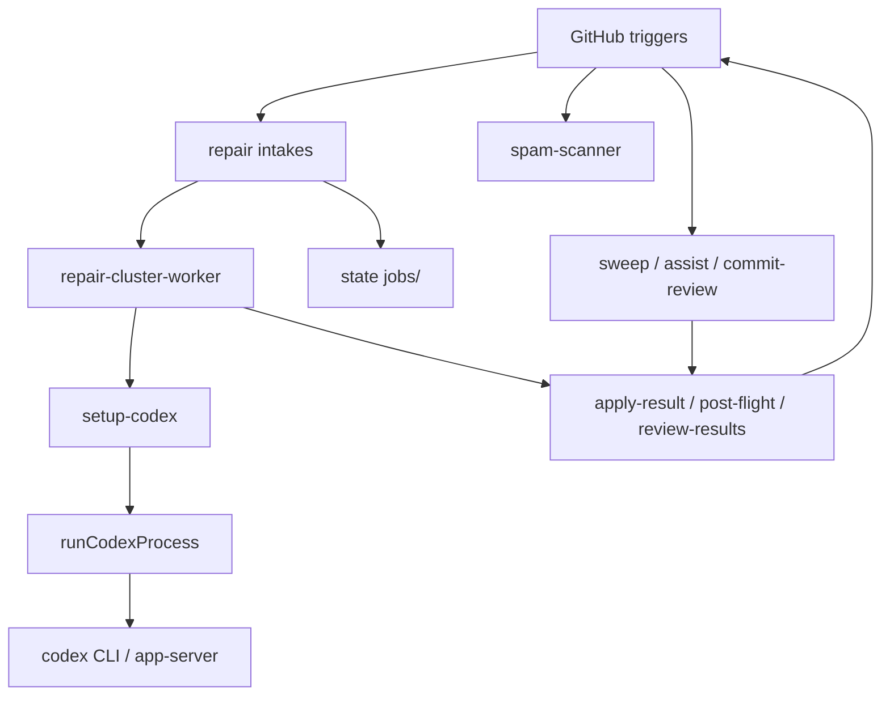
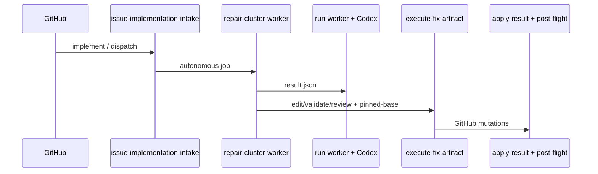
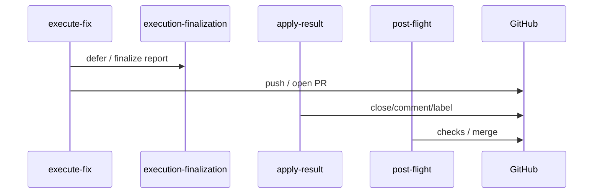

# Loop / ClawSweeper → Devin Port Map

**Audit date:** 2026-07-11
**Canonical repository:** [`kartikkabadi/loop`](https://github.com/kartikkabadi/loop) (private)
**Canonical local path:** `/Users/user/Developer/loop`
**Baseline SHA:** `a0a3b241af5c11b040d601b6fd117d2d451f9fbe`
**Original temporary-audit SHA:** `ef7a067f7170b422d40d03094cc69b2803c1ab2f`
**Scope:** Forensic audit + approved ACP/Box target architecture. Documentation only.

---

## 0. Repository identity

| Check | Observed |
|---|---|
| Product repo | `https://github.com/kartikkabadi/loop` |
| Local path | `/Users/user/Developer/loop` |
| `origin` | `https://github.com/kartikkabadi/loop.git` |
| `upstream` | `https://github.com/openclaw/clawsweeper.git` |
| Shallow? | `false` |
| Tags | `v0.1.0`, `v0.2.0`, `v0.3.0` |
| Push to upstream | Never |

Aligned at bootstrap: `main` = `origin/main` = `upstream/main` = `a0a3b241af5c11b040d601b6fd117d2d451f9fbe`.

### Upstream delta since temporary audit (`ef7a067..a0a3b241af`)

```text
a0a3b241af fix: pin repair review bases and renew post-flight credentials (#494)
6826d1dac2 chore(repo): extend pnpm release-age window
```

| Status | Path | Port impact |
|---|---|---|
| M | `.github/workflows/repair-cluster-worker.yml` | Post-flight token renew; still `setup-codex` |
| M | `pnpm-workspace.yaml` | Release-age only |
| M | `src/repair/execute-fix-artifact.ts` | Deepens Codex coupling: pinned `targetBaseSha`, post-sync `runCodexReview` |
| A | `src/repair/execution-finalization.ts` | Model-neutral helpers — preserve |
| A | `src/repair/execution-finalization.test.ts` | Neutral tests |
| M | `src/repair/fix-prompt-builder.ts` | Pinned base SHA in prompts |
| M | `src/repair/target-validation.ts` | Pinned-base validation |
| M | `test/repair/execute-fix-artifact-source.test.ts` | Pinned-base / review wiring |
| A | `test/repair/execute-fix-publication.test.ts` | Publication finalization |

---

## 1. Executive conclusion

Loop retains ClawSweeper’s autonomous GitHub lifecycle and replaces the Codex/OpenAI **agent** with **Devin**, driven through **Devin ACP** (`devin acp` as a local stdio JSON-RPC subprocess).

**Approved production topology:**

```text
GitHub Actions / ClawSweeper coordinator
        │ Crabbox provision, sync, launch, collect, stop
        ▼
ASCII Box
        ├── Box-hosted Loop agent worker
        │     ├── ACP client
        │     ├── spawns `devin acp` locally
        │     ├── validates/writes result artifacts
        │     └── emits heartbeat and evidence
        └── repository checkout / worktree
GitHub Actions ← artifacts → deterministic CI + authorized GitHub mutations
```

**Hard constraints:**

1. Phase 0 empirical ACP-on-Box proof **before** freezing the permanent TypeScript API.
2. Permanent contract is session/capability-oriented (`AgentSessionRuntime`), not `run() → stdout/stderr`.
3. `CodexProcessAdapter` is transitional only.
4. ACP client colocated with `devin acp` inside Box; do not assume `crabbox run` is a duplex ACP pipe (`ssh -n` / `ReadAll` in Crabbox `internal/cli/ssh.go`).
5. Production Devin credentials live on Box only — not on GitHub-hosted runners.
6. Independent review = fresh session **and** clean exact-head checkout (preferred: separate verifier Box).
7. `devin -p` is diagnostic only; `devin acp --agent-type review` is CLI-observed, unproven for Loop gates.
8. Preserve #494 pinned-base post-sync review (`execution-finalization.ts`, `execute-fix-artifact.ts`).
9. No greenfield Cloudflare control plane.

ClawSweeper intake, jobs, validators, mutations, ledgers, and automerge are largely model-neutral and must survive the port.

---

## 2. Current architecture

```text
GitHub events / schedule / comments
  → GitHub Actions (Blacksmith / ubuntu-latest)
      → setup-codex + App token mint
      → Node CLIs (pnpm → dist/*.js)
          → clawsweeper.ts / run-worker.ts / execute-fix-artifact.ts
          → runCodexProcess (src/codex-process.ts)
              → codex-process-worker.ts  OR  codex-app-server-worker.ts
          → deterministic apply-result / post-flight / review-results / execution-finalization
  → openclaw/clawsweeper-state (records/, jobs/, results/)
```

**Security invariant today:** `codexEnv()` (`src/codex-env.ts`) strips GitHub write tokens and App keys from the model subprocess. Loop must preserve an equivalent scrub at the Devin boundary.

**Execution plane today:** GHA Blacksmith/`ubuntu-latest`. Crabbox (`.crabbox.yaml`, `crabbox-hydrate.yml`) is hydrate/operator proof, not the production repair host.

---

## 3. Complete Codex-coupling inventory

### 3.1 Lexical scan (reproducible)

See **Appendix A** for the full path list and per-path classification.

| Metric | Value |
|---|---|
| Lexical matches | **142** tracked files |
| Semantic meaning | Not a coupling count — keyword scan |
| structural_runtime | 44 |
| workflow_auth | 8 |
| schema_result | 3 |
| test | 56 |
| terminology_docs | 30 |
| incidental_binary | 1 |

### 3.2 Structural hotspots (must replace or adapt)

| File | Key symbols | Coupling |
|---|---|---|
| `src/codex-process.ts` | `runCodexProcess`, `codexAppServerProcessOptionsFromEnv` | Worker vs app-server |
| `src/codex-process-worker.ts` | `spawnCodex`, `terminateCodexProcessTree` | Stdio relay |
| `src/codex-app-server-worker.ts` | `thread/start`, `thread/resume`, `turn/start`, `turn/steer`, `turn/interrupt` | Codex app-server JSON-RPC |
| `src/codex-spawn.ts` | `codexProcessCommand`, `spawnCodex` | `CODEX_BIN` |
| `src/codex-env.ts` | `codexEnv`, `codexModelArgs` | Auth scrub / model alias |
| `src/codex-output-capture.ts` | `openCodexOutputCapture` | Tail capture |
| `src/codex-transient.ts` | `codexJsonlFailureDetail` | JSONL / rate-limit taxonomy |
| `src/clawsweeper.ts` | `runCodex`, `runCodexAssist` | Review `codex exec --output-schema` |
| `src/commit-sweeper.ts`, `src/pr-close-coverage-proof.ts` | `runCodexProcess` | Commit / proof |
| `src/repair/run-worker.ts` | `runCodex`, `repairResultIfNeeded` | Plan + structured-result repair |
| `src/repair/execute-fix-artifact.ts` | `runCodexReview`, `reviewAfterFinalBaseSync` | Edit/validate/review + #494 |
| `src/repair/process-env.ts` | `codexSubprocessEnv` | Repair env |
| `src/repair/collect-codex-debug.ts` | `collectCodexDebug` | `CODEX_HOME` harvest |
| `src/repair/spam-scanner.ts` | `scanWithModel` | Direct OpenAI Responses API |
| `.github/actions/setup-codex/action.yml` | Install `@openai/codex@0.139.0` + proxy | CI auth |
| `scripts/check-local-codex.mjs` | Local smoke | Codex login/exec |
| `schema/*.json` | Decision + repair schemas | `--output-schema` / `codex_review` |

### 3.3 Workflows installing/invoking Codex or OpenAI

| Workflow | Codex install | Model invoke | Secrets |
|---|---|---|---|
| `sweep.yml` | `setup-codex` | `pnpm review` | `OPENAI_API_KEY`, `CLAWSWEEPER_MODEL` |
| `assist.yml` | yes | assist | same |
| `commit-review.yml` | yes | commit-sweeper | same |
| `maintainer-activity-report.yml` | yes | report gen | same |
| `repair-cluster-worker.yml` | yes | plan + execute | same + CrabFleet; post-flight token renew |
| `repair-commit-finding-intake.yml` | yes | execute | same |
| `spam-scanner.yml` | no | Responses API | `OPENAI_API_KEY` |

---

## 4. Model-neutral systems to preserve

**Classes:** (1) completely model-neutral · (2) mostly neutral + Codex terminology · (3) structurally Codex-coupled · (4) obsolete in Devin-only · (5) uncertain / Phase 0

| System | Class | Primary files |
|---|---|---|
| Issue/PR intake | **(1)** | `comment-router*.ts`, `issue-implementation-intake.ts`, `pr-repair-intake.ts` |
| Job creation | **(1)** | `create-job.ts`, intake renderers |
| Durable job identity | **(1)** | `lib.ts` `validateJob`, `job-intent.ts`, `jobs/` |
| Scheduling | **(1)** | workflow cron/dispatch, `dispatch-jobs.ts` |
| Work lanes | **(1)** | plan / execute / autonomous modes |
| Concurrency | **(1)** | workflow concurrency groups, `live-worker-capacity.ts` |
| Deduplication | **(1)** | `dispatch-receipt-owner.sh`, intake ledgers |
| Target validation | **(1)** | `target-validation.ts` |
| Exact-head validation | **(1)** | conflict-self-heal, sweep stale-head checks |
| Repair clustering | **(1)** | `plan-cluster.ts`, gitcrawl import |
| Deterministic planning shortcuts | **(1)** | `deterministic-automerge-result.ts` |
| Deterministic result validation | **(1)** / field **(2)** | `review-results.ts` (`codex_review`) |
| Comment routing | **(1)** | `comment-router*.ts` |
| GitHub mutations | **(1)** | `apply-result.ts`, `execute-fix-github.ts` |
| Checks / post-flight | **(1)** | `post-flight.ts` |
| Completion ledgers | **(1)** | `publish-main.ts`, `publish-result.ts` |
| Automerge policy | **(1)** | automerge modules + `post-flight` |
| Dashboards / state publication | **(1)** | `dashboard/`, notify modules |
| Limits / budgets | **(1)** | `limits.ts`, timeout-budget modules |
| Crabbox transport | **(1)** today; **(5)** Devin wiring | `.crabbox.yaml`, hydrate workflow |
| Codex spawn / app-server | **(3)** | `src/codex-*.ts` |
| setup-codex | **(3)** | `.github/actions/setup-codex` |
| Review prompts | **(2)** | `prompts/*`, `fix-prompt-builder.ts` |
| Steerable sessions | **(3)** | `action-session.ts` + app-server |
| collect-codex-debug | **(3)** | `collect-codex-debug.ts` |
| structured-result repair | **(3)** | `repairResultIfNeeded` |
| spam scanner OpenAI | **(3)** / product **(5)** | `spam-scanner.ts` |
| check-local-codex | **(4)** | `scripts/check-local-codex.mjs` |
| execution-finalization (#494) | **(1)** | `execution-finalization.ts` |
| Devin ACP / Box worker | **(5)** | Not in repo yet |
| Permanent `AgentRuntime.run()` | **(4)** | Rejected as final contract |

---

## 5. Runtime execution-flow maps

### Combined topology



### Flow 1 — Issue implementation

| Field | Detail |
|---|---|
| Entrypoint | `repair-issue-implementation-intake.yml` (`clawsweeper_issue_implementation`) |
| Workflow | Intake → `repair:dispatch` → `repair-cluster-worker.yml` (`mode: autonomous`) |
| Commands | `repair:issue-implementation-intake -- prepare`; `repair:dispatch`; `repair:worker`; `repair:execute-fix`; `repair:apply-result`; `repair:post-flight` |
| Symbols | `issue-implementation-intake.ts`, `dispatch-jobs.ts`, `run-worker.ts`, `execute-fix-artifact.ts`, `execution-finalization.ts`, `apply-result.ts`, `post-flight.ts` |
| Runtime today | GHA Blacksmith + `setup-codex` + `runCodexProcess` |
| Credentials | App private key; `OPENAI_API_KEY`/`CLAWSWEEPER_MODEL`; status ingest |
| Env | `CLAWSWEEPER_ALLOW_*`, `CLAWSWEEPER_AUTO_IMPLEMENT_*`, `CLAWSWEEPER_CODEX_*`, `CLAWSWEEPER_FIX_*` |
| Input | Review report + live issue |
| Output | `jobs/.../issue-*.md`; run dir `result.json` / `fix-execution-report.json`; PR |
| Persistence | `clawsweeper-state`; GHA artifacts |
| Retry | Capacity wait; Codex transport retries; edit/review loops; `repairResultIfNeeded` |
| Timeout | Intake 30m; cluster 90m; execute 75m; step 70m; fix Codex budgets |
| Cancellation | `cancel-in-progress: false`; SIGTERM process tree |
| Final validator | `review-results.ts`; `target-validation.ts`; pinned-base `runCodexReview` + `reviewAfterFinalBaseSync`; `apply-result` / `post-flight` |



### Flow 2 — PR / issue review

| Field | Detail |
|---|---|
| Entrypoint | `sweep.yml` (also assist / commit-review / local-review variants) |
| Workflow / action | `setup-codex` → `pnpm run review` → `pnpm run apply-decisions` |
| Commands | `pnpm run review`; `pnpm run apply-decisions`; optional `retry-failed-reviews` |
| Symbols | `clawsweeper.ts` `runCodex`; `codex-process.ts`; `schema/clawsweeper-decision.schema.json`; apply-decision parsers |
| Runtime process | GHA + `setup-codex`; `codex exec --output-schema --output-last-message --json` |
| Credentials | `OPENAI_API_KEY`, App private key; optional read `ghToken` scrubbed into Codex |
| Env | `CLAWSWEEPER_CODEX_TIMEOUT_MS`, `CLAWSWEEPER_CODEX_REVIEW_ATTEMPTS`, model aliases |
| Input artifact | Issue/PR payload + repo checkout |
| Output artifact | Decision JSON; durable review comments via apply |
| Persistence | GHA artifacts; GitHub comments/labels |
| Retry | Multi-attempt `runCodex`; `retry-failed-reviews` |
| Timeout | Per-item timeout; outer `timeout --kill-after=30s` |
| Cancellation | Job cancel / SIGTERM process tree |
| Final validator | Schema + decision parser; apply drift/`updated_at`/exact-head guards |

### Flow 3 — Repair planning

| Field | Detail |
|---|---|
| Entrypoint | `repair-cluster-worker.yml` plan / plan half of autonomous |
| Workflow / action | `setup-codex` → `repair:validate-job` → `repair:worker --mode plan` |
| Commands | `repair:validate-job`; `repair:worker --mode plan` |
| Symbols | `run-worker.ts`, `plan-cluster.ts`, `deterministic-automerge-result.ts` |
| Runtime process | `codex exec` planner sandbox; optional app-server if steerable |
| Credentials | `OPENAI_API_KEY` / model; App key for host GitHub reads; status ingest |
| Env | `CLAWSWEEPER_CODEX_*`, planner sandbox flags, job allowlists |
| Input artifact | Job markdown / cluster inputs from state repo |
| Output artifact | `prompt.md`, `cluster-plan.json`, `fix-artifact.json`, `result.json`, `codex.jsonl` |
| Persistence | Run dir under GHA workspace + state publish |
| Retry | Codex transport retries; deterministic shortcuts may skip model |
| Timeout | Job 90m; `CLAWSWEEPER_CODEX_TIMEOUT_MS` default 1_800_000 |
| Cancellation | SIGTERM / job cancel; `cancel-in-progress: false` |
| Final validator | `review-results.ts` + `schema/repair/codex-result.schema.json` |

### Flow 4 — Repair execution

| Field | Detail |
|---|---|
| Entrypoint | `repair-cluster-worker.yml` execute job |
| Workflow / action | `setup-codex` → `repair:execute-fix` → apply/post-flight |
| Commands | `repair:execute-fix`; `--publish-report-only`; `apply-result`; `post-flight` |
| Symbols | `execute-fix-artifact.ts` (`runCodexReview`, `validateAndReviewLoop`); `target-validation.ts`; `execution-finalization.ts` |
| Runtime process | Codex edit/review loops via `runCodexProcess`; host validation commands |
| Credentials | Target **write** App token on host only; stripped from Codex env |
| Env | `CLAWSWEEPER_FIX_*`, `CLAWSWEEPER_CODEX_REVIEW_ATTEMPTS`, validation mode |
| Input artifact | Plan `result.json` / fix artifact |
| Output artifact | `fix-execution-report.json`; branch/PR; `merge_preflight.codex_review` |
| Persistence | Branch + PR on target; run artifacts; state ledgers |
| Retry | Edit/review loops; validation re-runs; transport retries |
| Timeout | Execute job 75m; step 70m; Codex review budgets |
| Cancellation | SIGTERM process tree; job cancel |
| Final validator | Target validation commands; Codex `/review`; `reviewAfterFinalBaseSync`; post-flight checks |

### Flow 5 — Autonomous repair

| Field | Detail |
|---|---|
| Entrypoint | Intake → dispatch with `mode: autonomous` (issue implementation / PR repair) |
| Workflow / action | Same `repair-cluster-worker.yml` autonomous path |
| Commands | Plan + execute + apply + post-flight in one job topology |
| Symbols | Flows 3–4 symbols + `prompts/repair/autonomous.md` |
| Runtime process | Codex plan then execute; host gates for PR/merge |
| Credentials | Same as Flows 3–4; write tokens host-only |
| Env | `CLAWSWEEPER_ALLOW_EXECUTE` / `ALLOW_FIX_PR` / `ALLOW_MERGE` + Codex envs |
| Input / output | Job → `result.json` → PR/report → ledgers |
| Persistence | State jobs + GitHub PR + artifacts |
| Retry / timeout / cancel | Same as Flows 3–4; capacity wait on dispatch |
| Final validator | Flows 3–4 validators + automerge policy modules |

### Flow 6 — Result validation

| Field | Detail |
|---|---|
| Entrypoint | Worker “Review worker result” step; also from `run-worker.ts` |
| Workflow / action | Host step only — no `setup-codex` required for validation itself |
| Command | `pnpm run repair:review-results` |
| Symbols | `review-results.ts`, `repair-contract.ts` |
| Runtime process | Pure Node — **no model** |
| Credentials | None for model; may read artifacts only |
| Env | Schema paths / job context |
| Input artifact | `result.json` (+ related run files) |
| Output artifact | Pass/fail report; failure JSON for repair |
| Persistence | Run dir failure artifacts |
| Retry | N/A (deterministic); caller may invoke Flow 7 |
| Timeout | Step timeout only |
| Cancellation | Step cancel |
| Final validator | This flow **is** the validator |

### Flow 7 — Structured-result repair

| Field | Detail |
|---|---|
| Entrypoint | `run-worker.ts` `repairResultIfNeeded()` (~L350) |
| Workflow / action | Inside plan worker after failed `review-results` |
| Command | Second `runCodex` / `codex exec` with failure context |
| Symbols | `repairResultIfNeeded`, `run-worker.ts`, `review-results.ts` |
| Runtime process | Codex repair pass |
| Credentials | Same as plan lane; scrubbed model env |
| Env | `CLAWSWEEPER_RESULT_REPAIR_ATTEMPTS` (default 1), `CLAWSWEEPER_RESULT_REPAIR_TIMEOUT_MS` |
| Input artifact | Failed `result.json` + `review-results-failed-N.json` |
| Output artifact | `result.before-repair-N.json`, repaired `result.json`, `codex-repair-N.jsonl` |
| Persistence | Run dir |
| Retry | Bounded by `RESULT_REPAIR_ATTEMPTS` |
| Timeout | `RESULT_REPAIR_TIMEOUT_MS` |
| Cancellation | Same as plan Codex cancel |
| Final validator | `review-results.ts` must pass |

### Flow 8 — Steerable / resumable sessions

| Field | Detail |
|---|---|
| Entrypoint | Steerable repair worker when `CLAWSWEEPER_STEERABLE_CODEX=1` |
| Workflow / action | `repair-cluster-worker.yml` + CrabFleet action-session registration |
| Commands | App-server worker path via `runCodexProcess` options |
| Symbols | `action-session.ts`; `codexAppServerProcessOptionsFromEnv`; `codex-app-server-worker.ts` |
| Runtime process | Codex app-server JSON-RPC (`thread/*`, `turn/*`) |
| Credentials | `CLAWSWEEPER_CRABFLEET_SERVICE_TOKEN` / agent token |
| Env | `CLAWSWEEPER_STEERABLE_CODEX`, thread-state paths, PTY/token URLs |
| Input / output | Same plan/execute artifacts + session events |
| Persistence | Actions cache on `$CODEX_HOME/sessions` + thread state JSON |
| Retry | Transport/session resume when configured |
| Timeout | Host budgets + turn timeouts |
| Cancellation | `turn/interrupt` + SIGTERM |
| Final validator | Host validators unchanged |
| Target | Devin ACP on Box (steer parity **unknown** until Phase 0) |

### Flow 9 — Timeout and cancellation

| Field | Detail |
|---|---|
| Entrypoint | Cross-cutting — every model and host step |
| Workflow / action | GHA `timeout-minutes`; host budget helpers; process wrappers |
| Commands / symbols | `repairTimeoutBudgetFromEnv`, `remainingRepairBudgetMs`, `terminateCodexProcessTree`, `timeout --kill-after` |
| Runtime process | GHA killer + Node timers + Codex/app-server interrupt |
| Credentials | N/A |
| Env | Job/step timeouts; `CLAWSWEEPER_CODEX_TIMEOUT_MS`; repair budgets |
| Input / output | N/A (control plane) |
| Persistence | Partial artifacts may remain on timeout |
| Retry | Caller-dependent; transport retries separate |
| Timeout | Cluster 90 / execute 75 / step 70; Codex budgets |
| Cancellation | Job cancel; SIGTERM tree; app-server `turn/interrupt`; policy `cancel-in-progress: false` |
| Final validator | Post-timeout host must not treat partial model output as success |
| Target | ACP `session/cancel` + Box worker kill (**phase0**) |

### Flow 10 — Completion and GitHub mutation

| Field | Detail |
|---|---|
| Entrypoint | After successful execute/report |
| Workflow / action | `repair-cluster-worker.yml` apply + post-flight (+ publish) |
| Commands | `execute-fix --publish-report-only`; `apply-result`; `post-flight`; `tag-clawsweeper`; `publish-main` |
| Symbols | `execution-finalization.ts`, `apply-result.ts`, `post-flight.ts`, `git-publish.ts` |
| Runtime process | Host Node only — **no model** for mutations |
| Credentials | Renewed write App token for post-flight (#494) — never to model |
| Env | Allow-merge / allow-fix-PR gates; status ingest |
| Input artifact | Execution report / decisions |
| Output artifact | PR updates, labels, merges, state ledgers, tags |
| Persistence | GitHub + `clawsweeper-state` |
| Retry | Post-flight renew + re-check; apply drift guards |
| Timeout | Post-flight step budgets |
| Cancellation | Job cancel mid-mutation — must leave consistent ledger state |
| Final validator | `apply-result` policies; `post-flight` merge/check/thread gates; sweep apply drift rules |



---

## 6. Codex → Devin capability matrix

Evidence tags: **official** · **cli-observed** · **phase0** · **generic-acp** · **unknown**

| Requirement | Codex today | Proposed Devin | Evidence | Notes |
|---|---|---|---|---|
| Startup | `codex` / app-server | Box worker spawns `devin acp` | official + phase0 | Colocated stdio |
| Auth | Responses proxy / login | Box credentials file; ACP `authenticate` if required | official / cli-observed / phase0 | No GHA production auth |
| Session create | `thread/start` | ACP `session/new` | generic-acp + phase0 | |
| Load / resume / close / list | thread state + cache | Only if advertised | generic-acp → phase0 | Do not assume |
| Prompt | `turn/start` / exec | ACP `session/prompt` | generic-acp + phase0 | |
| Stream | JSONL / deltas | ACP `session/update` | generic-acp + phase0 | |
| Cancel | `turn/interrupt` / SIGTERM | ACP `session/cancel` + kill | generic-acp + phase0 | |
| Mid-turn steer | `turn/steer` | unknown | unknown | Fallback cancel+reprompt if resume proven |
| Permissions | Codex sandbox flags | ACP permission requests under host policy | generic-acp + phase0 | |
| Structured output | `--output-schema` | Host schema on agent-written JSON | phase0 | No Devin CLI schema flag proven |
| Independent review | Codex `/review` + pinned base | Fresh session + clean exact-head tree | phase0 | `--agent-type review` unproven |
| Remote host | GHA Blacksmith | Crabbox → ASCII Box | phase0 | |
| `devin -p` | n/a | Diagnostic only | cli-observed | Not production |
| OS sandbox | Codex sandboxes | Devin `--sandbox` preview | cli-observed / unknown on Box | |
| #494 pinned-base re-review | `reviewAfterFinalBaseSync` | Same host gate + Devin review session | high (host) / phase0 (agent) | Preserve |

Installed CLI snapshot: `devin 3000.1.27`; `devin acp --help` shows `--agent-type summarizer|review`; `devin auth status` logged in; team Sandbox: optional.

---

## 7. Proposed session-oriented runtime boundary

### Not the permanent contract

```ts
interface AgentRuntime {
  run(...): AgentRuntimeResult | Promise<AgentRuntimeResult>;
}
```

That mirrors `runCodexProcess` and may describe an internal transitional adapter only.

### Required semantic operations

```text
initialize and negotiate capabilities
authenticate when required
create a session
load or resume a session when advertised
submit a prompt turn
stream normalized runtime events
handle permission requests under host policy
cancel the active turn
close the session when supported
capture transcript/evidence
report structured stop reason and failure category
```

### Provisional conceptual shape (docs only; freeze after Phase 0)

```ts
interface AgentSessionRuntime {
  initialize(request: RuntimeInitializeRequest): Promise<RuntimeCapabilities>;
  createSession(request: CreateAgentSessionRequest): Promise<AgentSession>;
  loadSession?(request: LoadAgentSessionRequest): Promise<AgentSession>;
  resumeSession?(request: ResumeAgentSessionRequest): Promise<AgentSession>;
  prompt(request: AgentPromptRequest, events: AgentEventSink): Promise<AgentTurnResult>;
  cancel(request: CancelAgentTurnRequest): Promise<void>;
  closeSession?(request: CloseAgentSessionRequest): Promise<void>;
}
```

Rules: capability-gate optionals; no raw Codex argv on generic contract; no public raw `ProcessEnv`; implementations sanitize child env; never introduce GitHub write credentials; normalize session ID, stop reason, failure class, artifacts, transcript refs, capabilities, resumability.

### Temporary compatibility adapter

```text
CodexProcessAdapter
```

Wraps current `runCodexProcess` / app-server behavior. Not `AgentSessionRuntime`.

### Execution-host boundary

```text
CrabboxWorkspaceHost
  acquire or reuse Box lease
  synchronize repository and worker bundle
  launch Box-hosted worker
  observe process and heartbeat
  collect result/evidence artifacts
  stop or release Box
```

---

## 8. Box-hosted Devin worker responsibilities

The Box worker must:

1. Spawn `devin acp` locally and speak ACP JSON-RPC over stdio.
2. Negotiate capabilities via `initialize`; authenticate only when required.
3. Create/prompt/cancel sessions; use load/resume/close only if advertised.
4. Apply host permission policy for tool/fs/terminal requests.
5. Write structured result JSON + evidence/transcripts for host validators.
6. Emit heartbeats observable by Crabbox/coordinator.
7. Support independent reviewer sessions on clean exact-head checkouts.
8. Preserve pinned-base post-sync review semantics (#494) by invoking a fresh review turn after base sync when required.
9. Never receive GitHub write tokens, App private keys, Box API keys, or CF admin tokens.

`devin -p` may exist only as a diagnostic helper beside the worker, never as the autonomous path.

---

## 9. Crabbox / ASCII Box integration map

| Question | Finding |
|---|---|
| Production repair/review host today? | No — Blacksmith / ubuntu-latest |
| In-repo Crabbox | `.crabbox.yaml` (AWS), `crabbox-hydrate.yml`, `.agents/skills/crabbox` |
| ASCII Box | Sibling Crabbox `internal/providers/asciibox` + `docs/providers/ascii-box.md` |
| Stream stdin | `runSSHStreamResult` uses `sshArgsNoInput` / `-n` — not duplex ACP |
| Input helper | `runSSHInput` → `io.ReadAll` before launch — one-shot |
| Default ACP topology | Client **inside** Box |
| Sufficiency | Provider likely sufficient; workflows must be wired |
| CrabFleet vs Crabbox | Steerable sessions use CrabFleet today; orthogonal to Crabbox |

---

## 10. Credentials and security implications

### Final placement (approved)

| Holder | May hold |
|---|---|
| GHA / coordinator | GitHub App; Crabbox controller; ASCII Box API key; state/publish/status/hooks |
| Box worker | Narrow task assignment; repo sync; explicit test secrets |
| Devin process | Devin auth + sanitized task env only |

**No production `setup-devin` on GHA.** Actions invoke Crabbox; model runs on Box.

### Current credential matrix

| Name | Storage | Workflows | Process | Model sees? | Permissions | Lifetime | Devin replacement | Leak impact |
|---|---|---|---|---|---|---|---|---|
| `OPENAI_API_KEY` | GHA secret | sweep, assist, commit-review, maintainer-report, repair-cluster-worker, spam-scanner | setup-codex; spam HTTP | No (proxy); **Yes** (spam) | OpenAI API | Secret | Remove after cutover | Spend / abuse |
| `CLAWSWEEPER_MODEL` / `INTERNAL_MODEL` | GHA secret | Codex workflows | `CODEX_HOME/config.toml` | Indirect | Model alias | Secret | Box Devin model config | Model identity |
| `CLAWSWEEPER_APP_PRIVATE_KEY` | GHA secret | Most workflows | App token mint | **No** | Installation tokens | Secret | Keep on GHA | Critical |
| State publish tokens | Minted from App | publish-main / setup-state | git/`gh` to state repo | No | State write | Short-lived | Keep | State tamper |
| `CLAWSWEEPER_STATUS_INGEST_TOKEN` | GHA secret | dashboard / status steps | HTTP ingest | No | Status publish | Secret | Keep | Fake status |
| `CLAWSWEEPER_CRABFLEET_SERVICE_TOKEN` | GHA secret | steerable worker | action-session register | No | Session create | Secret | Keep/replace | Session hijack |
| `CLAWSWEEPER_CRABFLEET_AGENT_TOKEN` | Ephemeral mint | steerable updates | action-session update | No | Work-state POST | Per session | Keep/replace with Box-side steer channel after Phase 0 | Steer surface |
| `CLAWSWEEPER_OPENCLAW_HOOK_*` | GHA secrets | notify workflows | openclaw-hook | No | Notifications | Secret | Keep | Spoofed alerts |
| Cloudflare Access / deploy tokens | GHA secrets | dashboard / reports | Wrangler/CF | No | Workers/Pages/Access | Secret | Keep | Dashboard takeover |
| `CLAWSWEEPER_WEBHOOK_SECRET` | GHA secret | dashboard / exact-review | HMAC | No | Webhook auth | Secret | Keep | Queue abuse |
| Exact-review HMAC | Derived | exact-review-reconcile | HMAC verify | No | Reconcile POST | Per request | Keep | Same |
| `CODEX_HOME` / proxy | Ephemeral/cache | setup-codex | Codex state | N/A | Local | Run/cache | Remove | Transcript leak |
| `PROXY_API_KEY` | Generated | setup-codex | responses proxy | No | Proxy | Per run | Remove | Proxy abuse |
| `ASCII_BOX_API_KEY` | Operator / future secret | Crabbox | Box provision | No | Box control | Operator | Add for Loop | VM control |
| Devin credentials | Box `credentials.toml` | Box worker only | `devin acp` | Runtime auth | Devin account | User/session | Required on Box | Account/spend |
| Crabbox/AWS operator keys | Operator | hydrate proof | Crabbox CLI | No | Cloud VM | Operator | Controller on GHA only | Infra compromise |
| `GH_TOKEN` / installation tokens | Minted | repair/review | host `gh`/git | No (optional read via scrubbed path) | Scoped | Minutes | Keep on GHA | Repo R/W |

---

## 11. Testing implications

Categories: **reusable unchanged** · **reusable after terminology** · **adapter contract** · **Codex-specific removable later** · **missing before porting**.

| Proves | Representative files | Classification |
|---|---|---|
| Process invocation | `codex-process.test.ts`, spawn/env tests | Adapter contract |
| App-server behavior | `codex-app-server` coverage via process tests / source tests | Adapter contract → later Devin ACP fixtures |
| Session resume | `action-session.test.ts`; app-server thread state | Reusable after terminology; Devin path **missing** |
| Steering | Steerable env / app-server steer paths | Codex-specific until Phase 0 proves ACP steer |
| Interruption | Process-tree terminate tests; interrupt paths | Adapter contract + **missing** ACP cancel fixtures |
| Timeout | Timeout-budget / process timeout tests | Reusable unchanged / adapter |
| Structured results | `review-results` / schema contract tests | Reusable unchanged; host-only PR 1 expands |
| Result repair | `run-worker.test.ts` repair paths | Adapter contract |
| Autonomous workflows | Intake / dispatch / execute source tests | Reusable unchanged |
| GitHub mutation isolation | `security-boundary`, `process-env`, apply/post-flight | Reusable unchanged |
| Deterministic validation | `target-validation`, `deterministic-automerge-result`, contract/lib | Reusable unchanged |
| #494 pinned-base finalization | `execution-finalization.test.ts`, `execute-fix-publication.test.ts`, `execute-fix-artifact-source.test.ts` | Reusable unchanged (+ adapter where Codex review wired) |
| Workflow structure | `sweep-workflow.test.ts` | Reusable unchanged (Bash 3.2 env flake separate) |
| Codex-only runners / debug | `codex-review-runner`, `codex-transient`, `collect-codex-debug`, local-review | Codex-specific removable later |
| ACP client; Box canary; capability-gated ops; reviewer isolation; Devin error taxonomy; env audit | — | **Missing before porting** |

---

## 12. Known unknowns and empirical spikes

Phase 0 must prove (pass/fail matrix):

1. Box provisioning via Crabbox and/or `box` CLI
2. Repo/worker sync
3. ACP client inside Box
4. Local `devin acp`
5. Exact `initialize` capabilities
6. Stored-credential auth
7. Runtime `authenticate` if required
8–10. `session/new`, `session/prompt`, `session/update`
11. Client-side requests (permissions/fs/terminal/extensions)
12. Cancel during active tool op
13. Second prompt same session
14–15. Restart / Box stop-resume recovery **when advertised**
16. Structured JSON + host validation
17. Independent review on exact-head checkout
18. Env audit (no GitHub/Box control creds in Devin)
19. Artifact collection via Crabbox
20. Box stop/release cleanup

Additional unknowns: mid-turn steer; `--agent-type review` adequacy; OS sandbox on Box; spam without OpenAI; Devin error taxonomy vs `codex-transient.ts`.

---

## 13. Safe deletion criteria for Codex / OpenAI

Delete only when all hold:

1. Phase 0 matrix accepted; production uses Box-hosted ACP worker.
2. `AgentSessionRuntime` + `CodexProcessAdapter` exist; Devin path default for cut-over lanes.
3. No production workflow hosts Devin on GHA; OpenAI not required for cut-over lanes (spam resolved).
4. Independent-review isolation proven.
5. Pinned-base post-sync review proven on Devin path.
6. Steerable Codex app-server replaced or explicitly retired.
7. Tests green; Codex-only tests removed/quarantined.
8. Rollback retained through soak.
9. Secrets removed after soak.

Until then: do not delete `src/codex-*.ts` or `setup-codex`.

---

## 14. Risks ranked by severity

| Sev | Risk |
|---|---|
| **P0** | Production Devin on GHA / final `setup-devin` |
| **P0** | `devin -p` as durable autonomous runtime |
| **P0** | Losing #494 pinned-base post-sync review |
| **P0** | GitHub write / App / Box API keys in Devin env |
| **P0** | Permanent `AgentRuntime.run()` as product contract |
| **P1** | Freezing API before Phase 0 |
| **P1** | Assuming `crabbox run` is duplex ACP |
| **P1** | Session-ID-only “independent review” |
| **P1** | No host schema enforcement without `--output-schema` |
| **P1** | Unknown mid-turn steer |
| **P1** | OpenAI spam path blocking “no OpenAI” |
| **P2** | Dashboard/workflows still assume `setup-codex` |
| **P2** | Premature `codex_review` rename |
| **P2** | Crabbox hydrate mistaken for production host |
| **P2** | Post-flight token expiry without renew |
| **P3** | `check-local-codex` drift; Bash 3.2 unit flake; lexical≠semantic counts |

---

## 15. Recommended small-PR sequence

See `TASKS.md` for full PR specs. Order:

```text
0A Box/Crabbox transport proof
0B ACP client protocol proof (inside Box)
0C session/restart/reviewer/security proof
1  host result-contract tests
2A AgentSessionRuntime contracts (capability-shaped from Phase 0)
2B CodexProcessAdapter (behavior-preserving)
2C CrabboxWorkspaceHost boundary
3  Box-hosted Devin ACP worker
4  Crabbox execution integration (opt-in beside Codex)
5A–5E role cutovers (plan → build → review → result-repair → CI-repair)
6  workflow/credential cutover (no GHA Devin)
7  autonomous soak
8  remove Codex/OpenAI
```

---

## Baseline (canonical clone)

| Command | Exit | Notes |
|---|---:|---|
| `pnpm install` / `build:all` / `lint` / `format:check` / surface / limits | 0 | Node 24.14.1 |
| `pnpm run test:unit` | 1 | 805/807; Bash 3.2 `${TARGET_REPO,,}` environment failure |
| `pnpm run test:repair` | 0 | 705/705 |

---

## Appendix A — Lexical match classification (142 paths)

**Command:**

```bash
git ls-files -z \
  | xargs -0 git grep -l -i -E 'codex|openai|OPENAI_API_KEY|CODEX_HOME|app-server|output-schema|output-last-message' -- \
  | grep -Ev '^(DEVIN_PORT_MAP\.md|TASKS\.md|CHANGELOG\.md)$' \
  | sort -u
```

**Result:** 142 tracked files matching lexical patterns (not a semantic coupling count).

| Bucket | Count |
|---|---:|
| structural_runtime | 44 |
| workflow_auth | 8 |
| schema_result | 3 |
| test | 56 |
| terminology_docs | 30 |
| incidental_binary | 1 |
| **Total** | **142** |

### structural_runtime (44)

- `.github/workflows/ci.yml`
- `.github/workflows/repair-cluster-intake.yml`
- `.github/workflows/repair-comment-router.yml`
- `.github/workflows/repair-issue-implementation-intake.yml`
- `.github/workflows/spam-comment-intake.yml`
- `dashboard/worker.ts`
- `package.json`
- `tsconfig.repair.json`
- `scripts/check-local-codex.mjs`
- `scripts/dashboard-smoke.mjs`
- `src/clawsweeper.ts`
- `src/codex-app-server-worker.ts`
- `src/codex-env.ts`
- `src/codex-output-capture.ts`
- `src/codex-process-worker.ts`
- `src/codex-process.ts`
- `src/codex-spawn.ts`
- `src/codex-transient.ts`
- `src/commit-classifier.ts`
- `src/commit-sweeper.ts`
- `src/pr-close-coverage-proof.ts`
- `src/review-history.ts`
- `src/repair/adaptive-review-budget.ts`
- `src/repair/apply-result.ts`
- `src/repair/collect-codex-debug.ts`
- `src/repair/comment-router-core.ts`
- `src/repair/comment-router.ts`
- `src/repair/comment-webhook.ts`
- `src/repair/deterministic-automerge-result.ts`
- `src/repair/execute-fix-artifact.ts`
- `src/repair/execute-fix-timeout-budget.ts`
- `src/repair/external-messages.ts`
- `src/repair/finalize-open-prs.ts`
- `src/repair/fix-prompt-builder.ts`
- `src/repair/lib.ts`
- `src/repair/post-flight.ts`
- `src/repair/process-env.ts`
- `src/repair/repair-merge-message.ts`
- `src/repair/run-worker.ts`
- `src/repair/spam-scanner.ts`
- `src/repair/sweep-status-merge.ts`
- `src/repair/target-validation.ts`
- `src/repair/url-safety.ts`
- `src/repair/workflow-utils.ts`

### workflow_auth (8)

- `.github/actions/setup-codex/action.yml`
- `.github/workflows/assist.yml`
- `.github/workflows/commit-review.yml`
- `.github/workflows/maintainer-activity-report.yml`
- `.github/workflows/repair-cluster-worker.yml`
- `.github/workflows/repair-commit-finding-intake.yml`
- `.github/workflows/spam-scanner.yml`
- `.github/workflows/sweep.yml`

### schema_result (3)

- `schema/clawsweeper-decision.schema.json`
- `schema/repair/codex-result.schema.json`
- `src/repair/review-results.ts`

### test (56)

- `src/repair/execute-fix-timeout-budget.test.ts`
- `src/repair/fix-prompt-builder.test.ts`
- `test/apply-close-retry-policy.test.ts`
- `test/apply-label-sync.test.ts`
- `test/apply-pr-coverage-proof-close.test.ts`
- `test/apply-pr-coverage-proof-recheck.test.ts`
- `test/apply-pr-duplicate-proof.test.ts`
- `test/apply-pr-duplicate-ref-proof.test.ts`
- `test/apply-pr-promotion.test.ts`
- `test/apply-pr-supersession-safety.test.ts`
- `test/apply-runtime-budget.test.ts`
- `test/apply-same-author-pair-close.test.ts`
- `test/clawsweeper.test.ts`
- `test/close-reasons.test.ts`
- `test/codex-process.test.ts`
- `test/codex-review-runner.test.ts`
- `test/command.test.ts`
- `test/context.test.ts`
- `test/dashboard-worker.test.ts`
- `test/decision-packets.test.ts`
- `test/failed-review-retry.test.ts`
- `test/helpers.ts`
- `test/local-range-review.test.ts`
- `test/pr-proof-automation.test.ts`
- `test/pr-review-comment-risk.test.ts`
- `test/pr-review-labels.test.ts`
- `test/pr-surface-policy.test.ts`
- `test/repair/adaptive-review-budget.test.ts`
- `test/repair/apply-result.test.ts`
- `test/repair/codex-transient.test.ts`
- `test/repair/collect-codex-debug.test.ts`
- `test/repair/comment-router-core.test.ts`
- `test/repair/comment-webhook.test.ts`
- `test/repair/deterministic-automerge-result.test.ts`
- `test/repair/execute-fix-artifact-source.test.ts`
- `test/repair/fix-edit-policy.test.ts`
- `test/repair/git-repo-utils.test.ts`
- `test/repair/issue-implementation-intake.test.ts`
- `test/repair/issue-implementation-status.test.ts`
- `test/repair/lib.test.ts`
- `test/repair/live-worker-capacity.test.ts`
- `test/repair/mechanical-rebase-conflicts.test.ts`
- `test/repair/post-flight.test.ts`
- `test/repair/process-env.test.ts`
- `test/repair/repair-merge-message.test.ts`
- `test/repair/run-worker.test.ts`
- `test/repair/target-validation.test.ts`
- `test/repair/url-safety.test.ts`
- `test/repair/workflow-sparse-checkout.test.ts`
- `test/repair/workflow-utils.test.ts`
- `test/review-close-policy.test.ts`
- `test/review-comment-markers.test.ts`
- `test/review-comment-rendering.test.ts`
- `test/review-history.test.ts`
- `test/review-prompt-policy.test.ts`
- `test/sweep-workflow.test.ts`

### terminology_docs (30)

- `.agents/skills/crabbox/SKILL.md`
- `.agents/skills/local-clawsweeper-review/SKILL.md`
- `.crabbox.yaml`
- `AGENTS.md`
- `README.md`
- `docs/commit-sweeper.md`
- `docs/limits.md`
- `docs/live-dashboard.md`
- `docs/local-clawsweeper-skill.md`
- `docs/orchestration.md`
- `docs/pr-review-comments.md`
- `docs/repair/README.md`
- `docs/repair/auto-update-prs.md`
- `docs/repair/automerge-flow.md`
- `docs/repair/internal-features.md`
- `docs/repair/operations.md`
- `docs/scheduler.md`
- `docs/spam-scanner.md`
- `docs/steerable-repair-automation.md`
- `docs/target-dispatcher.md`
- `docs/work-lane.md`
- `instructions/merge-policy.md`
- `prompts/repair/autonomous.md`
- `prompts/repair/execute.md`
- `prompts/repair/worker-system.md`
- `prompts/review-item.md`
- `scripts/check-active-surface.ts`
- `scripts/check-limits.ts`
- `src/repair/constants.ts`
- `src/repair/plan-cluster.ts`

### incidental_binary (1)

- `assets/pr-eggs/openclaw-clawsweeper/74479.png`

`assets/pr-eggs/openclaw-clawsweeper/74479.png` matches via embedded C2PA/OpenAI image metadata (`gpt-image` / OpenAI OpCo), not code coupling.
